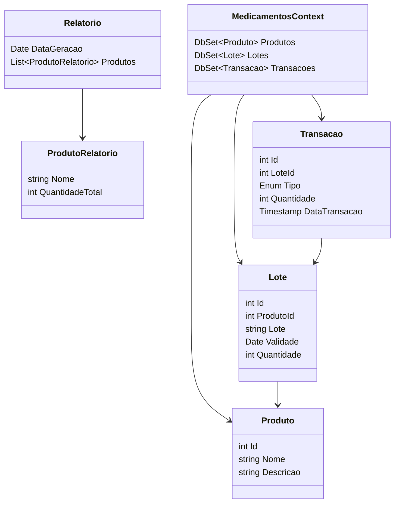

# APIs e Web Services

<!-- O planejamento de uma aplicação de APIS Web é uma etapa fundamental para o sucesso do projeto. Ao planejar adequadamente, você pode evitar muitos problemas e garantir que a sua API seja segura, escalável e eficiente.

Aqui estão algumas etapas importantes que devem ser consideradas no planejamento de uma aplicação de APIS Web.

[Inclua uma breve descrição do projeto.] -->

Este projeto visa desenvolver um sistema web para gerenciar medicamentos, utilizando uma arquitetura de microsserviços e comunicação assíncrona com RabbitMQ. O sistema permitirá realizar operações CRUD (Criar, Ler, Atualizar, Excluir) em um cadastro de medicamentos e gerar relatórios simples de estoque.

## Objetivos da API

<!-- O primeiro passo é definir os objetivos da sua API. O que você espera alcançar com ela? Você quer que ela seja usada por clientes externos ou apenas por aplicações internas? Quais são os recursos que a API deve fornecer?

[Inclua os objetivos da sua api.] -->

- Fornecer interface para operações CRUD de medicamentos: Permitir a criação, consulta, atualização e exclusão de registros de medicamentos através de endpoints RESTful.
- Gerenciar estoque de medicamentos: Manter o controle da quantidade de cada medicamento disponível.
- Gerar relatórios de estoque: Disponibilizar um relatório com o nome e a quantidade de cada medicamento.
- Comunicar-se de forma assíncrona: Utilizar RabbitMQ para propagar as atualizações de medicamentos e gerar relatórios em background.
- Implementar um sistema básico de autenticação, usando JWT.

## Arquitetura

<!-- [Descrição da arquitetura das APIs, incluindo os componentes e suas interações.] -->

- GestaoMedicamentos.Web (Interface Web):
  - Responsável por fornecer a interface do usuário, desenvolvida com React.
  - Consome a API Gateway para realizar operações CRUD de medicamentos e visualizar relatórios.
- GestaoMedicamentos.API (API Gateway):
  - Ponto de entrada único para todas as requisições da interface web.
  - Roteia as requisições para o microsserviço apropriado.
  - Implementa autenticação e autorização.
- GestaoMedicamentos.Produto (Microsserviço):
  - Gerencia as operações relacionadas aos medicamentos (CRUD).
  - Interage com o banco de dados para persistir os dados.
  - Publica eventos no RabbitMQ após operações de atualização no banco de dados.
- GestaoMedicamentos.Relatorios (Microsserviço):
  - Responsável por gerar e disponibilizar relatórios de estoque.
  - Consome mensagens do RabbitMQ para atualizar os relatórios em background.
- RabbitMQ (Message Broker):
  - Sistema de mensageria para comunicação assíncrona entre os microsserviços.
  - Utilizado para propagar as atualizações de medicamentos do microsserviço "Produto" para o "Relatórios".
- SQL Server (Banco de Dados):
  - Armazena os dados dos medicamentos.

## Modelagem da Aplicação

<!-- [Descreva a modelagem da aplicação, incluindo a estrutura de dados, diagramas de classes ou entidades, e outras representações visuais relevantes.] -->

### Diagrama de Classes



### Estrutura de Dados (Banco de Dados - MedicamentosDB)

**Tabela: Medicamentos**
| Coluna | Tipo | Chave Primária | Obrigatório |
| ------ | ---- | -------------- | ----------- |
| Id | int | Sim | Sim |
| Nome | varchar | Não | Sim |
| Quantidade | int | Não | Sim |

## Fluxo de Dados

<!-- [Diagrama ou descrição do fluxo de dados na aplicação.] -->

1. A Interface Web envia uma requisição [POST, GET, PUT, DELETE] para a API Gateway com os dados do medicamento.
2. A API Gateway valida a autenticação e repassa a requisição para o Microsserviço "Produto".
3. O Microsserviço "Produto" valida os dados e insere no banco de dados.
4. Após a inserção, o Microsserviço "Produto" publica uma mensagem no RabbitMQ informando a criação do novo medicamento.
5. O Microsserviço "Relatórios", que está consumindo mensagens da fila do RabbitMQ, recebe a mensagem.
6. O Microsserviço "Relatórios" atualiza seus dados internos e gera um novo relatório.
7. A Interface Web recebe a confirmação (independente do processamento do relatório).

## Requisitos Funcionais


| ID    | Descrição do Requisito                                                                                                       | Prioridade |
|-------|------------------------------------------------------------------------------------------------------------------------------|------------|
| **RF01** | **Gestão de Insumos:** O sistema deve oferecer funcionalidades de cadastro de insumos, busca e filtragem para que os usuários possam encontrar rapidamente informações sobre insumos específicos, facilitando a gestão e a localização de produtos no estoque. | **Alta**  |
| **RF02** | **Notificação de Validade:** O sistema deve enviar alertas e notificações sobre insumos próximos da data de validade ou vencidos, para que ações corretivas possam ser tomadas antes que os produtos se tornem inutilizáveis. | **Alta**  |
| **RF03** | **Controle de Estoque:** O sistema deve permitir o monitoramento e atualização da quantidade de insumos em estoque, com a capacidade de registrar entradas e saídas de produtos de forma precisa e em tempo real. | **Alta**  |
| **RF04** | **Controle de Acesso:** O sistema deve permitir que somente usuários autenticados possam acessar e gerenciar os medicamentos, com diferentes níveis de acesso (administrador, farmacêutico, etc.). | **Alta**   |
| **RF05** | **Histórico de Movimentações:** O sistema deve registrar um histórico de todas as operações realizadas, como criação, atualização e exclusão de medicamentos. | **Baixa**  |
| **RF06** | **Geração de Relatórios:** O sistema deve gerar relatórios de estoque, incluindo medicamentos em falta, com baixa quantidade ou próximos da validade. | **Média**  |


## Requisitos não Funcionais


| ID    | Descrição do Requisito                                                                                                                                                     | Prioridade |
|-------|------------------------------------------------------------------------------------------------------------------------------------------------------------------------------|------------|
| **RNF01** | **Desempenho:** O sistema deve ser capaz de suportar consultas e atualizações em tempo real, com um tempo de resposta inferior a 2 segundos para operações básicas. | **Alta**       |
| **RNF02** | **Segurança:** O sistema deve garantir a segurança através de criptografia de dados sensíveis e autenticação robusta. | **Alta**       |
| **RNF03** | **Compatibilidade:** O sistema deve ser compatível com os principais navegadores web (Chrome, Firefox, Edge, Safari) e dispositivos móveis (Android, iOS). | **Alta**       |
| **RNF04** | **Disponibilidade:** O sistema deve estar disponível para uso 24/7, com um tempo de inatividade planejado não superior a 1 hora por mês para manutenção. | **Alta**       |
| **RNF05** | **Manutenibilidade:** O sistema deve ser projetado para facilitar a manutenção e a atualização, com código limpo e documentação adequada. | **Alta**      |
| **RNF06** | **Backup:** O sistema deve realizar backups automáticos dos dados ao menos uma vez por dia, garantindo a recuperação em caso de falha. | **Alta**       |
| **RNF07** | **Tempo de Recuperação:** Em caso de falha, o sistema deve ser capaz de restaurar o serviço em até 1 hora. | **Alta**      |


## Tecnologias Utilizadas

Existem muitas tecnologias diferentes que podem ser usadas para desenvolver APIs Web. A tecnologia certa para o seu projeto dependerá dos seus objetivos, dos seus clientes e dos recursos que a API deve fornecer.

[Lista das tecnologias principais que serão utilizadas no projeto.]

## API Endpoints

<!-- [Liste os principais endpoints da API, incluindo as operações disponíveis, os parâmetros esperados e as respostas retornadas.] -->

| Método HTTP | Endpoint | Descrição |
|-------------|----------|-----------|
| POST | /api/Produtos | Criar um novo medicamento |
| GET | /api/Produtos/ | Obter detalhes de todos os medicamentos |
| GET | /api/Produtos/{id} | Obter detalhes de um medicamento pelo ID |
| PUT | /api/Produtos/{id} | Atualizar completamente um medicamento pelo ID |
| DELETE | /api/Produtos/{id} | Excluir um medicamento pelo ID |

### Endpoint 1
- Método: GET
- URL: /endpoint1
- Parâmetros:
  - param1: [descrição]
- Resposta:
  - Sucesso (200 OK)
    ```
    {
      "message": "Success",
      "data": {
        ...
      }
    }
    ```
  - Erro (4XX, 5XX)
    ```
    {
      "message": "Error",
      "error": {
        ...
      }
    }
    ```

## Considerações de Segurança

[Discuta as considerações de segurança relevantes para a aplicação distribuída, como autenticação, autorização, proteção contra ataques, etc.]

## Implantação

[Instruções para implantar a aplicação distribuída em um ambiente de produção.]

1. Defina os requisitos de hardware e software necessários para implantar a aplicação em um ambiente de produção.
2. Escolha uma plataforma de hospedagem adequada, como um provedor de nuvem ou um servidor dedicado.
3. Configure o ambiente de implantação, incluindo a instalação de dependências e configuração de variáveis de ambiente.
4. Faça o deploy da aplicação no ambiente escolhido, seguindo as instruções específicas da plataforma de hospedagem.
5. Realize testes para garantir que a aplicação esteja funcionando corretamente no ambiente de produção.

## Testes

[Descreva a estratégia de teste, incluindo os tipos de teste a serem realizados (unitários, integração, carga, etc.) e as ferramentas a serem utilizadas.]

1. Crie casos de teste para cobrir todos os requisitos funcionais e não funcionais da aplicação.
2. Implemente testes unitários para testar unidades individuais de código, como funções e classes.
3. Realize testes de integração para verificar a interação correta entre os componentes da aplicação.
4. Execute testes de carga para avaliar o desempenho da aplicação sob carga significativa.
5. Utilize ferramentas de teste adequadas, como frameworks de teste e ferramentas de automação de teste, para agilizar o processo de teste.

# Referências

Inclua todas as referências (livros, artigos, sites, etc) utilizados no desenvolvimento do trabalho.
