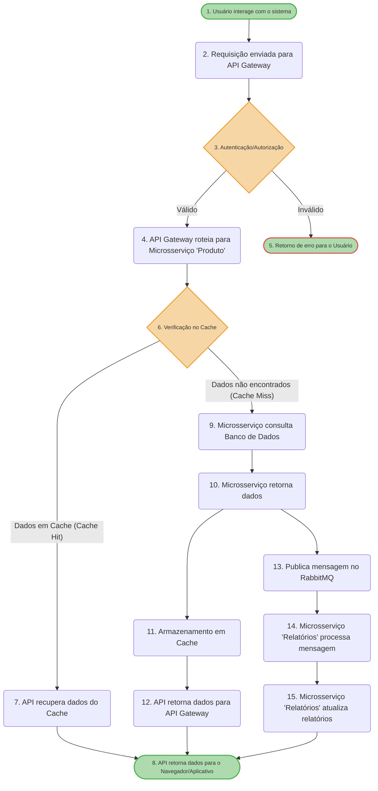

# Introdução

O desperdício de medicamentos no Brasil é um desafio significativo que impacta tanto as finanças do setor de saúde quanto a qualidade do atendimento aos pacientes. Estima-se que o país perde cerca de R$ 1 bilhão anualmente devido a desperdícios, que representam aproximadamente 20% dos medicamentos comprados por governos e hospitais privados. Essa questão se reflete em práticas inadequadas de gestão e controle, como evidenciado pela incineração de 214 toneladas de medicamentos e insumos no Estado do Rio de Janeiro em 2013, devido à expiração dos produtos. Além disso, o cenário é agravado por problemas relacionados à compra de grandes estoques sem controle eficaz, armazenamento impróprio e falhas na distribuição.

O descarte inadequado de medicamentos é um problema multifacetado, frequentemente associado à expiração das datas de validade e falhas na cadeia de frio. Em 2013, um exemplo notável ocorreu em Rondonópolis, onde vacinas foram rejeitadas por problemas de transporte e controle de temperatura. Esse incidente destaca a necessidade de melhores práticas e tecnologias, como o uso de dataloggers e caixas térmicas, para monitorar e registrar a temperatura durante o transporte e armazenamento de medicamentos.
A pesquisa realizada em 2013 pela Sensorweb revelou que 6,7% dos hospitais privados sofreram perdas significativas de insumos devido a desvios de temperatura, enquanto a Controladoria Geral da União (CGU) identificou, em 2008, que várias cidades incineraram medicamentos vencidos devido a condições inadequadas de armazenamento. Esses dados ilustram como a falta de controle e monitoramento eficaz pode levar a perdas substanciais e impactar a eficiência do sistema de saúde.

Apesar dos desafios, há iniciativas que demonstram o potencial para mitigar o desperdício. Hospitais e municípios têm investido em sistemas de gestão mais eficazes, que incluem controle de estoque e monitoramento de temperaturas. Esses investimentos não apenas ajudam a reduzir perdas financeiras, mas também melhoram o bem-estar dos pacientes. Além dos impactos diretos nas instituições de saúde e no governo, o desperdício de medicamentos também afeta as famílias de classe média, que enfrentam perdas estimadas em cerca de R$ 60,00 por ano com medicamentos vencidos.
O desperdício de medicamentos, insumos e vacinas no Brasil é um problema muitas vezes invisível, devido à sua ocorrência gradual ao longo do tempo. A Associação Nacional de Hospitais Privados (Anahp) estima que 20% do custo da saúde está relacionado à perda desses materiais. Exemplos de desperdício incluem a incineração de 700 toneladas de medicamentos no Rio de Janeiro em 2016 e o desperdício de 25 mil doses de vacinas em 2018. Globalmente, estudos mostram desperdícios de até US$ 15 milhões em insumos não utilizados.

Para enfrentar esses desafios, diversas práticas recomendadas têm sido identificadas. O mapeamento de fontes de desperdício é uma abordagem essencial para identificar as causas internas do problema. O Hospital Alemão Oswaldo Cruz, por exemplo, economizou R$ 3 milhões entre 2017 e 2018 ao implementar novas ferramentas de gestão de estoque. Além disso, a tecnologia desempenha um papel crucial na prevenção de perdas, com a utilização de soluções digitais para monitorar temperatura e umidade em tempo real. Sistemas automatizados para alertar sobre desvios de temperatura têm se mostrado eficazes na proteção de insumos.
Outra prática recomendada é a implementação de sistemas de verificação de validade que alertam sobre a proximidade da data de validade dos insumos. A Universidade do Kansas, por exemplo, conseguiu reduzir o desperdício de medicamentos em 32,2% e aumentar a eficiência em 56% com a adoção dessas soluções. Fomentar uma cultura de zero tolerância ao desperdício é igualmente importante, promovendo uma cultura organizacional que priorize a redução de desperdícios e ajuste a política de compras para alinhar com a demanda real.

A transparência e a capacitação dos colaboradores também são fundamentais para a redução do desperdício. Educar os funcionários sobre o impacto financeiro, a qualidade do atendimento e o meio ambiente é crucial para promover práticas sustentáveis e reduzir perdas.

A logística hospitalar, fundamental para otimizar a aquisição, movimentação e armazenamento de medicamentos e insumos, desempenha um papel central na transformação do déficit em lucro. Embora frequentemente confundida com o Supply Chain Management (SCM), a logística hospitalar foca em processos internos, enquanto o SCM abrange uma visão mais ampla interorganizacional. A cadeia de suprimentos representa a segunda maior despesa dos hospitais e um importante fator de receita, tornando sua gestão eficiente crucial para a sustentabilidade financeira das instituições.
O setor hospitalar enfrenta desafios adicionais, como o envelhecimento da população, defasagem na remuneração do SUS, alta dos custos dos medicamentos importados e uma crise econômico-política. Esses fatores têm contribuído para o fechamento de hospitais e dificuldades financeiras. Estudos indicam que hospitais enfrentam desperdícios de 20% a 30% em produtos e serviços, especialmente em estoques de medicamentos, gerando prejuízos significativos.

Erros médicos, como erros de medicação, são uma preocupação adicional, com 64% dos erros considerados evitáveis. Esses erros aumentam o tempo de internação e os custos hospitalares, consumindo mais de 10% dos gastos hospitalares. A adoção de práticas eficientes, como a dispensação de medicamentos por dose unitária, pode transformar o déficit em lucro ao reduzir a incidência de erros, diminuir estoques periféricos e melhorar a segurança e eficiência da administração de medicamentos.

Investir em logística hospitalar eficiente e em processos bem estruturados oferece uma oportunidade para melhorar a sustentabilidade financeira das instituições, combater desperdícios e assegurar a segurança e eficácia no tratamento dos pacientes.

## Problema
Parte das perdas de insumos farmaceuticos em setores hospitalares se deve à má gestão de estoques em suas farmácias.

A falta de um recurso de qualidade que atenda as necessidades das instituições hospitalares é um fator crucial para explicar as perdas em insumos farmaceuticos nesta área.

As perdas seriam mitigadas caso um melhor controle dos farmacos disponiveis e necessários à intituição fosse instaurado.

## Objetivos

O objetivo geral destre trabalho é produzir uma aplicação mobile para auxiliar os profissionais, envolvidos no ramo farmaceutico dentro de hospitais, na gestão de recursos disponíveis em estoque nestas instutuições e a consequente redução de perdas de farmacos devido a diversos fatores. 

Pode-se destacar com objetivos específicos a produção de uma aplicação de facil usabilidade que possa retornar métricas e informações uteis aos farmaceuticos sobre os recursos disponíveis e necessários à instuição.

Justificativa para o Desenvolvimento de um Aplicativo de Estoque para Farmácias

A realização deste trabalho é impulsionada pela necessidade crescente de soluções específicas para a gestão de estoques no setor farmacêutico. Diferente de outros segmentos, as farmácias lidam com produtos que exigem um controle rigoroso, tanto em termos de armazenamento quanto no cumprimento de regulamentações. Medicamentos, por exemplo, muitas vezes precisam ser mantidos sob condições precisas de temperatura, e a rastreabilidade desses itens é essencial para garantir sua qualidade e segurança.

Sistemas de controle de estoque que não são desenvolvidos pensando nas particularidades das farmácias podem deixar a desejar em aspectos críticos, como a manutenção adequada dos medicamentos e o cumprimento das normas de saúde. Isso pode resultar em perdas financeiras, além de comprometer a saúde dos pacientes devido ao uso de produtos mal armazenados ou expirados.

Portanto, o desenvolvimento de um aplicativo de gestão de estoques voltado especificamente para farmácias se justifica pela necessidade de uma solução que aborde esses desafios de forma integrada. Ao incluir funcionalidades como o monitoramento de temperatura e a gestão de receitas, o aplicativo proposto visa garantir que as farmácias possam operar de maneira segura, eficiente e conforme as exigências legais, respondendo de forma direta às necessidades do mercado.

## Público-Alvo

O aplicativo de gestão de estoques é voltado principalmente para gestores e proprietários de farmácias, sejam estabelecimentos independentes ou grandes redes. Esses profissionais precisam garantir que suas operações sejam eficientes e que estejam em conformidade com as rigorosas regulamentações sanitárias, especialmente no que diz respeito ao armazenamento e controle de medicamentos.

Além disso, o público-alvo inclui farmacêuticos que têm a responsabilidade de supervisionar tecnicamente a farmácia e garantir que todas as normas de saúde e segurança sejam seguidas. Eles necessitam de ferramentas que permitam um gerenciamento preciso e seguro dos estoques.

# Especificações do Projeto

## Requisitos

As tabelas a seguir apresentam os requisitos funcionais e não funcionais que definem o escopo do projeto de controle de estoque de medicamentos para farmácias. Cada requisito foi identificado com um ID único, acompanhado por uma descrição e uma prioridade atribuída.

Para determinar a prioridade dos requisitos, foi utilizada uma abordagem de classificação em três níveis:

**Alta:** Requisitos essenciais que são críticos para o funcionamento do sistema. Devem ser implementados na primeira versão do sistema, pois sua ausência comprometeria a funcionalidade principal.

**Média:** Requisitos importantes, mas que não são críticos para o funcionamento básico do sistema. Embora desejáveis, sua ausência não impede o uso do sistema, mas pode impactar a eficiência ou a experiência do usuário.

**Baixa:** Requisitos desejáveis que agregam valor, mas que podem ser adiados para versões futuras do sistema. Não são essenciais para o funcionamento inicial.

Essa classificação foi aplicada para garantir que os aspectos mais críticos do sistema sejam priorizados no desenvolvimento. As tabelas a seguir organizam os requisitos de acordo com essa priorização.

### Requisitos Funcionais

| ID    | Descrição do Requisito                                                                                                       | Prioridade |
|-------|------------------------------------------------------------------------------------------------------------------------------|------------|
| **RF01** | **Criar Novo Medicamento:** O usuário deve poder cadastrar novos medicamentos no sistema, inserindo dados como nome, princípio ativo, fabricante, data de validade, quantidade em estoque e preço. | **Alta**   |
| **RF02** | **Ler Medicamento:** O usuário deve poder consultar os dados de um medicamento específico, utilizando filtros como nome, princípio ativo ou código de barras. | **Alta**   |
| **RF03** | **Atualizar Medicamento:** O usuário deve poder atualizar os dados de um medicamento já cadastrado, como quantidade em estoque, preço e data de validade. | **Alta**   |
| **RF04** | **Excluir Medicamento:** O usuário deve poder remover um medicamento do sistema, caso ele não esteja mais disponível ou não seja mais vendido. | **Alta**  |
| **RF05** | **Interface Web:** O sistema deve ter uma interface web para acesso e gestão dos medicamentos. | **Alta**   |
| **RF06** | **Aplicativo Mobile:** O sistema deve contar com um aplicativo mobile para acesso e gestão dos medicamentos. | **Alta**   |
| **RF07** | **Controle de Acesso:** O sistema deve permitir que somente usuários autenticados possam acessar e gerenciar os medicamentos, com diferentes níveis de acesso (administrador, farmacêutico, etc.). | **Alta**   |
| **RF08** | **Histórico de Movimentações:** O sistema deve registrar um histórico de todas as operações realizadas, como criação, atualização e exclusão de medicamentos. | **Baixa**  |
| **RF09** | **Alerta de Validade:** O sistema deve notificar o usuário sobre medicamentos que estão próximos da data de validade. | **Média**  |
| **RF10** | **Relatórios:** O sistema deve gerar relatórios de estoque, incluindo medicamentos em falta, com baixa quantidade ou próximos da validade. | **Baixa**  |
| **RF11** | **Tela de Login/Cadastro:** O sistema deve exibir uma tela para login e cadastro de usuários, permitindo o acesso ao sistema de controle de estoque de medicamentos. | **Alta**   |
| **RF12** | **Seleção de Opção de Login/Cadastro:** O sistema deve exibir uma opção para o usuário selecionar entre login ou cadastro na plataforma. | **Alta**   |
| **RF13** | **Cadastro de Usuário:** O sistema deve permitir que o usuário final (farmacêuticos, administradores, etc.) se cadastre com dados como email, senha, telefone, CPF e número do registro profissional (CRF). | **Alta**   |
| **RF14** | **Login com Credenciais Existentes:** O sistema deve permitir que o usuário (funcionário ou administrador) entre com o seu email, senha. | **Alta**   |
| **RF15** | **Recuperação de Senha:** O sistema deve permitir a recuperação de senha para os usuários cadastrados, enviando um link de redefinição para o email registrado. | **Média**  |

### Requisitos não Funcionais

| ID    | Descrição do Requisito                                                                                                                                                     | Prioridade |
|-------|------------------------------------------------------------------------------------------------------------------------------------------------------------------------------|------------|
| **RNF01** | **Desempenho:** O sistema deve ser capaz de suportar consultas e atualizações em tempo real, com um tempo de resposta inferior a 2 segundos para operações básicas. | **Alta**       |
| **RNF02** | **Segurança:** O sistema deve garantir a segurança através de criptografia de dados sensíveis e autenticação robusta. | **Alta**       |
| **RNF03** | **Escalabilidade:** O sistema deve ser escalável para suportar um aumento no número de usuários e medicamentos cadastrados, sem perda de desempenho. | **Média**      |
| **RNF04** | **Usabilidade:** A interface deve ser intuitiva e fácil de usar, permitindo que usuários com diferentes níveis de conhecimento tecnológico possam utilizar o sistema sem dificuldades. | **Alta**       |
| **RNF05** | **Compatibilidade:** O sistema deve ser compatível com os principais navegadores web (Chrome, Firefox, Edge, Safari) e dispositivos móveis (Android, iOS). | **Alta**       |
| **RNF06** | **Disponibilidade:** O sistema deve estar disponível para uso 24/7, com um tempo de inatividade planejado não superior a 1 hora por mês para manutenção. | **Alta**       |
| **RNF07** | **Manutenibilidade:** O sistema deve ser projetado para facilitar a manutenção e a atualização, com código limpo e documentação adequada. | **Alta**      |
| **RNF08** | **Backup:** O sistema deve realizar backups automáticos dos dados ao menos uma vez por dia, garantindo a recuperação em caso de falha. | **Alta**       |
| **RNF09** | **Tempo de Recuperação:** Em caso de falha, o sistema deve ser capaz de restaurar o serviço em até 1 hora. | **Alta**      |

Com base nas Histórias de Usuário, enumere os requisitos da sua solução. Classifique esses requisitos em dois grupos:

- [Requisitos Funcionais
 (RF)](https://pt.wikipedia.org/wiki/Requisito_funcional):
 correspondem a uma funcionalidade que deve estar presente na
  plataforma (ex: cadastro de usuário).
- [Requisitos Não Funcionais
  (RNF)](https://pt.wikipedia.org/wiki/Requisito_n%C3%A3o_funcional):
  correspondem a uma característica técnica, seja de usabilidade,
  desempenho, confiabilidade, segurança ou outro (ex: suporte a
  dispositivos iOS e Android).
Lembre-se que cada requisito deve corresponder à uma e somente uma
característica alvo da sua solução. Além disso, certifique-se de que
todos os aspectos capturados nas Histórias de Usuário foram cobertos.

## Restrições

O projeto está restrito pelos itens apresentados na tabela a seguir.

|ID| Restrição                                             |
|--|-------------------------------------------------------|
|01| O projeto deverá ser entregue até o final do semestre |
|02| Deverá ser desenvolvido uma aplicação web       |
|03| Deverá ser desenvolvida uma aplicação mobile       |

Enumere as restrições à sua solução. Lembre-se de que as restrições geralmente limitam a solução candidata.

> **Links Úteis**:
> - [O que são Requisitos Funcionais e Requisitos Não Funcionais?](https://codificar.com.br/requisitos-funcionais-nao-funcionais/)
> - [O que são requisitos funcionais e requisitos não funcionais?](https://analisederequisitos.com.br/requisitos-funcionais-e-requisitos-nao-funcionais-o-que-sao/)

# Catálogo de Serviços

|ID|Serviço|Descição|
|--|-------|--------|
|01|Controle de usuários|Capacidade de cadastrar e autenticar usuários permitindo o acesso a página web, além de permitir a edição de informações do usuário cadastrado.|
|02|Gerenciamento de medicamentos|Capacidade de manipular o cadastro, edição e exclusão de medicamentos (CRUD). Além de permitir pesquisas por meio de filtros, acessar mais informações sobre o medicamento como quandidade no estoque, data validade e descrições e atualização simultânea da listagem de medicamentos após modificações.|
|03|Notificações|Capacidade de notificar o usuário a respeito de ações realizadas ao medicamento (Criação, edição e exclusão) por meio de pop-ups na página web ou por email, contendo mais detalhes a respeito da ação realizada ao medicamento, email este podendo ser enviado para o email do próprio usuário ou para outros emails personalizados.|
|04|Relatórios|Capacidade de gerar relatórios com informações sobre o estoque da farmácia além de possuir alertas a respeito de produtos em falta, em baixa quantidade ou próximos da data de validade. Tais informações serão exibidas em uma página web contendo a opção de baixa-la em formato PDF.|

# Arquitetura da Solução

## Definição dos Componentes

- **Interface Web**: Onde o usuário interage com o sistema.
- **API Gateway**: Ponto de entrada para todas as requisições, responsável por autenticação, autorização e roteamento.
- **Microsserviço "Produto"**: Gerencia as operações relacionadas aos medicamentos.
- **Banco de Dados (SQL Server)**: Armazena os dados dos medicamentos.
- **RabbitMQ**: Sistema para comunicação assíncrona entre microsserviços.
- **Microsserviço "Relatórios"**: Atualiza e gera relatórios de estoque.

## Fluxo de Interação

### Criar um Novo Medicamento

- O usuário (Admin) insere os dados de um novo medicamento na interface web.
- A interface web envia uma requisição HTTP POST para a API Gateway com os dados do novo medicamento.
- A API Gateway valida a autenticação do usuário e verifica as permissões.
- A API Gateway roteia a requisição para o microsserviço “Produto”.
- O microsserviço “Produto” recebe a requisição, valida os dados e insere o novo medicamento no banco de dados (SQL Server).
- Após a inserção, o microsserviço “Produto” envia uma mensagem para o RabbitMQ informando a criação do novo medicamento.
- O microsserviço “Relatórios” recebe a mensagem e atualiza os relatórios de estoque.
- O microsserviço “Produto” retorna uma resposta HTTP 201 (Created) para a API Gateway.
- A API Gateway repassa a resposta para a interface web.
- A interface web exibe uma mensagem de sucesso para o usuário.

### Ler um Medicamento

- O usuário (Admin) solicita a visualização dos dados de um medicamento na interface web.
- A interface web envia uma requisição HTTP GET para a API Gateway.
- A API Gateway valida a autenticação do usuário e verifica as permissões.
- A API Gateway roteia a requisição para o microsserviço “Produto”.
- O microsserviço “Produto” consulta o banco de dados (SQL Server) e retorna os dados do medicamento.
- O microsserviço “Produto” retorna uma resposta HTTP 200 (OK) com os dados do medicamento para a API Gateway.
- A API Gateway repassa a resposta para a interface web.
- A interface web exibe os dados do medicamento para o usuário.

### Atualizar um Medicamento

- O usuário (Admin) edita os dados de um medicamento na interface web.
- A interface web envia uma requisição HTTP PUT para a API Gateway com os dados atualizados.
- A API Gateway valida a autenticação do usuário e verifica as permissões.
- A API Gateway roteia a requisição para o microsserviço “Produto”.
- O microsserviço “Produto” recebe a requisição, valida os dados e atualiza o medicamento no banco de dados (SQL Server).
- Após a atualização, o microsserviço “Produto” envia uma mensagem para o RabbitMQ informando a atualização do medicamento.
- O microsserviço “Relatórios” recebe a mensagem e atualiza os relatórios de estoque.
- O microsserviço “Produto” retorna uma resposta HTTP 200 (OK) para a API Gateway.
- A API Gateway repassa a resposta para a interface web.
- A interface web exibe uma mensagem de sucesso para o usuário.

### Excluir um Medicamento

- O usuário (Admin) solicita a exclusão de um medicamento na interface web.
- A interface web envia uma requisição HTTP DELETE para a API Gateway.
- A API Gateway valida a autenticação do usuário e verifica as permissões.
- A API Gateway roteia a requisição para o microsserviço “Produto”.
- O microsserviço “Produto” recebe a requisição e remove o medicamento do banco de dados (SQL Server).
- Após a exclusão, o microsserviço “Produto” envia uma mensagem para o RabbitMQ informando a exclusão do medicamento.
- O microsserviço “Relatórios” recebe a mensagem e atualiza os relatórios de estoque.
- O microsserviço “Produto” retorna uma resposta HTTP 200 (OK) para a API Gateway.
- A API Gateway repassa a resposta para a interface web.
- A interface web exibe uma mensagem de sucesso para o usuário.

### Atualização do Banco de Dados

- O microsserviço "Produto" recebe a requisição.
- O microsserviço "Produto" valida os dados.
- O microsserviço "Produto" atualiza o medicamento no banco de dados (SQL Server).

### Notificação de Atualização

- Após a atualização, o microsserviço "Produto" envia uma mensagem para o RabbitMQ informando a atualização.

### Atualização de Relatórios

- O microsserviço "Relatórios", subscrito na fila do RabbitMQ, recebe a mensagem.
- O microsserviço "Relatórios" atualiza os relatórios de estoque em background.

### Confirmação da Operação

- O microsserviço "Produto" retorna uma resposta HTTP 200 (OK) para a API Gateway.
- A API Gateway repassa a resposta para a interface web.
- A interface web exibe uma mensagem de sucesso para o usuário.

<!--  -->

## Tecnologias Utilizadas

- Linguagem de Programação: C# (Backend) / HTML, CSS, JS (Frontend).
- Framework Backend: ASP.NET Core (para criação de APIs RESTful).
- Framework Frontend: React (para interface web responsiva) / React Native (para aplicativo móvel).
- Banco de Dados: SQL Server (confiabilidade e robustez).
- Cache: Redis (armazenamento em memória para alta performance).
- Message Broker: RabbitMQ (comunicação assíncrona e escalabilidade).
- IDEs: Visual Studio, Visual Studio Code.
- Ferramentas: Git (controle de versão), Swagger (documentação da API).

<!-- | Passo | Ação | Detalhes |
|---|---|---|
| 1 | Usuário interage com o sistema | Acessa o sistema via Navegador/Aplicativo. |
| 2 | Requisição enviada para a API | O Navegador/Aplicativo envia a requisição para a API (ASP.NET Core). |
| 3 | Verificação no Cache | A API verifica se os dados solicitados estão presentes no Cache (Redis). |
| 4 | Dados em Cache (Cache Hit) | Se os dados estiverem no cache:   - A API recupera os dados do Cache.   - A API retorna os dados para o Navegador/Aplicativo. |
| 5 | Dados não encontrados no Cache (Cache Miss) | Se os dados não estiverem no cache:   - A API publica uma mensagem na fila (RabbitMQ). |
| 6 | Microserviço processa a mensagem | O Microserviço (C#) consome a mensagem da fila. |
| 7 | Consulta ao Banco de Dados | O Microserviço consulta o Banco de Dados (SQL Server) pelos dados. |
| 8 | Retorno dos dados | O Microserviço retorna os dados para a fila (RabbitMQ). |
| 9 | API processa os dados | A API consome a mensagem da fila com os dados. | 
| 10 | Armazenamento em Cache | A API armazena os dados no Cache (Redis) para futuras requisições. |
| 11 | Retorno para o Usuário | A API retorna os dados para o Navegador/Aplicativo, que os exibe para o Usuário. | -->

## Hospedagem

Explique como a hospedagem e o lançamento da plataforma foi feita.

> **Links Úteis**:
>
> - [Website com GitHub Pages](https://pages.github.com/)
> - [Programação colaborativa com Repl.it](https://repl.it/)
> - [Getting Started with Heroku](https://devcenter.heroku.com/start)
> - [Publicando Seu Site No Heroku](http://pythonclub.com.br/publicando-seu-hello-world-no-heroku.html)
